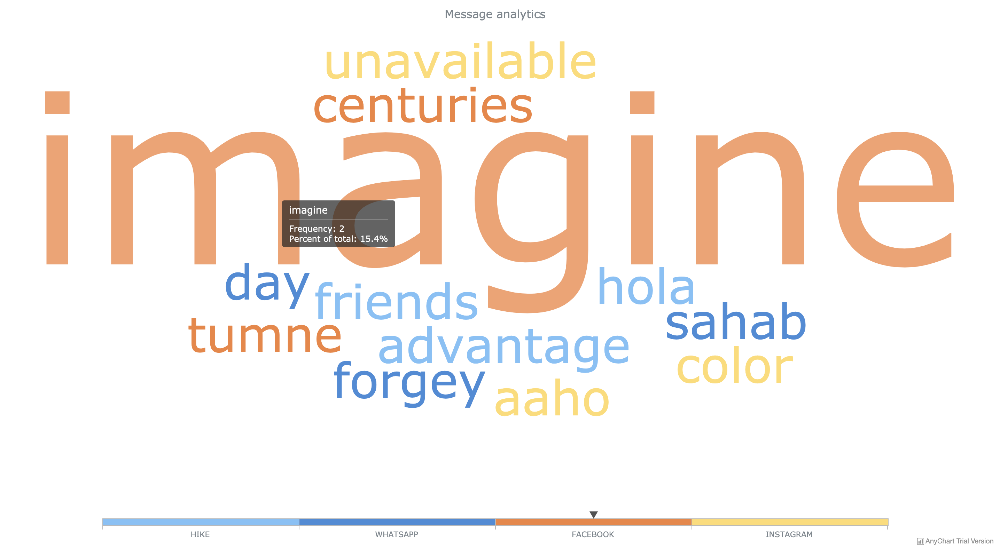
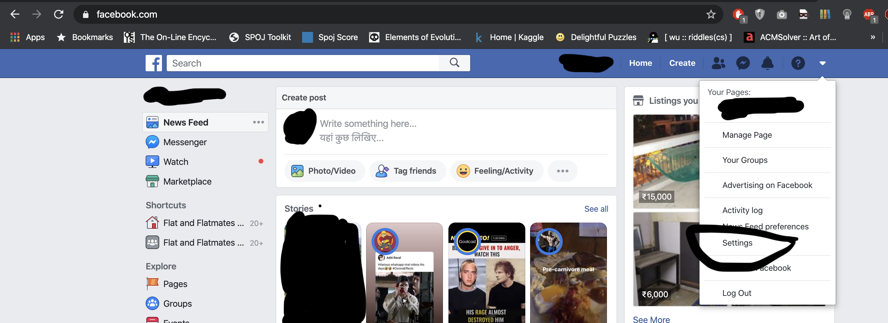
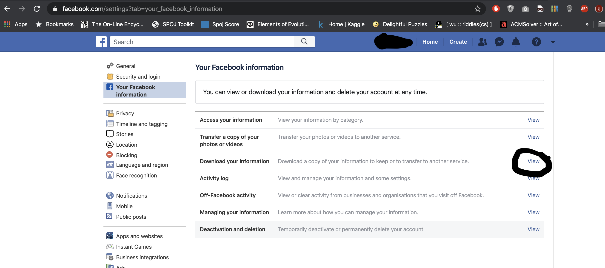
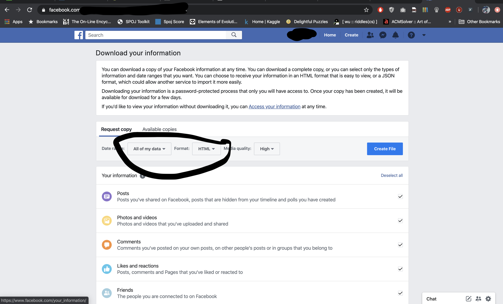
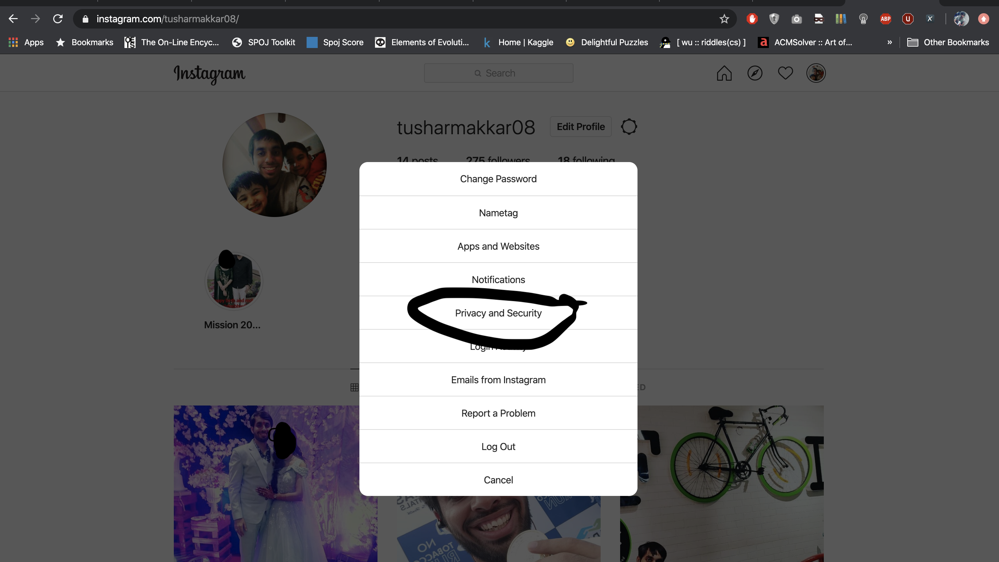
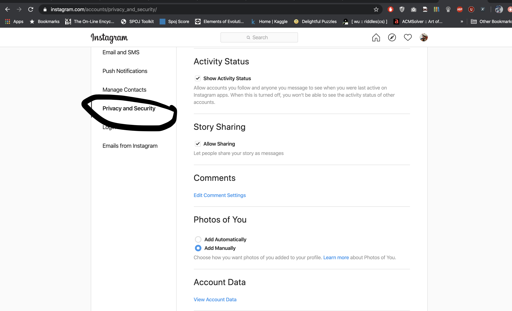
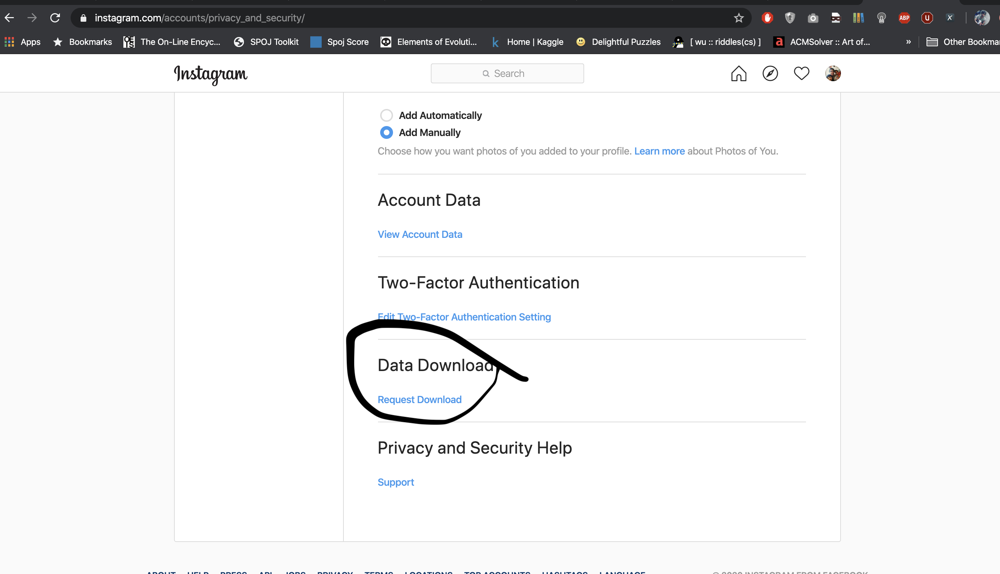
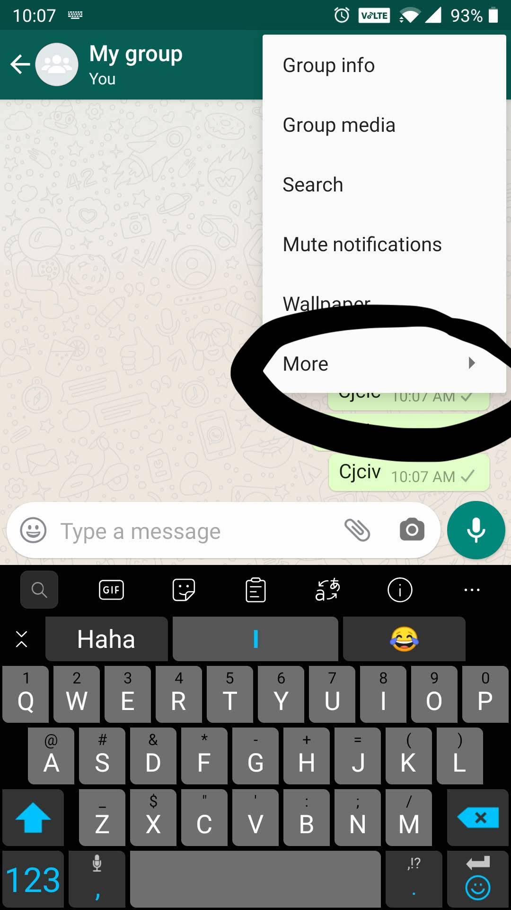
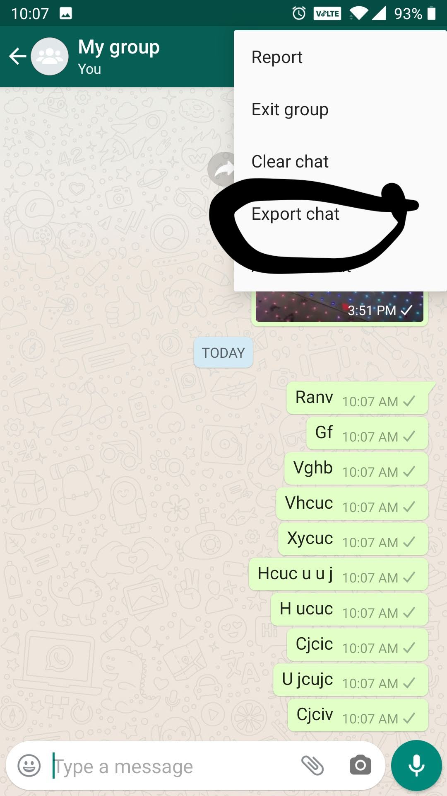
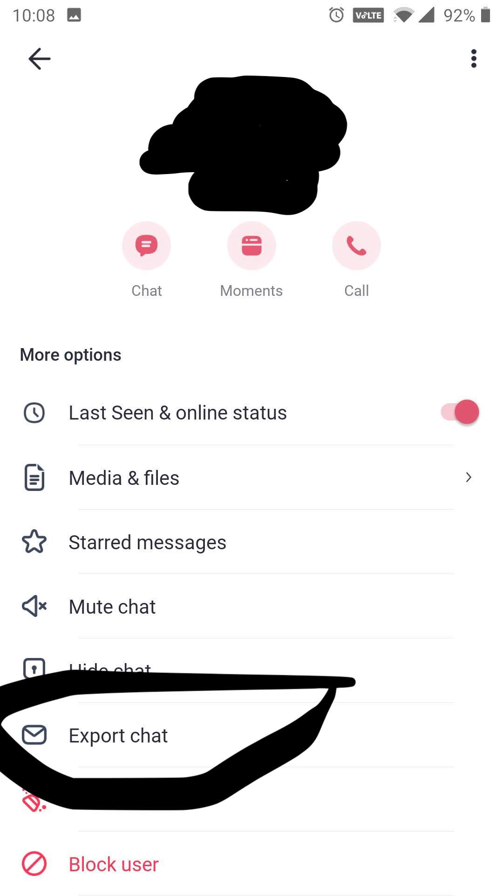

# message-wordcloud

Wordcloud from messages in all the popular social media messaging platform.
Right now it supports:

- Facebook
- Whatsapp
- Instagram
- Hike

#### Sample Result:

You can find the result [here](http://tusharmakkar08.github.io/wordcloud.html). 

Sample screenshot: 

#### Running code instructions

    python message_wordcloud.py --folder sample_data/ --ig_names "a" "b"

Help:

    usage: message_wordcloud.py [-h] --ig_names IG_NAMES IG_NAMES --folder FOLDER
    
    Argument parser for wordcloud
    
    optional arguments:
      -h, --help            show this help message and exit
      --ig_names IG_NAMES IG_NAMES
                            Instagram name list
      --folder FOLDER       Folder where files are present

Currently, we are expecting file names as follows:
* Facebook - `fb.json`
* Hike - `hike.txt`
* Instagram - `ig.json`
* Whatsapp - `wp.txt`

#### Downloading data instructions

###### Facebook:
* Go to settings 

* Click on your facebook information and then click on download your information.

* Select format as Json and select the message field from the list.

###### Instagram:
* Go to settings > privacy and security 

* Then click on download data.

###### Whatsapp:
* Go to more from the whatsapp chat

* Click on export. 

###### Hike:
* Go to profile of the chat and click on export.

#### References

* [Anycloud](https://github.com/AnyChart/AnyChart)
